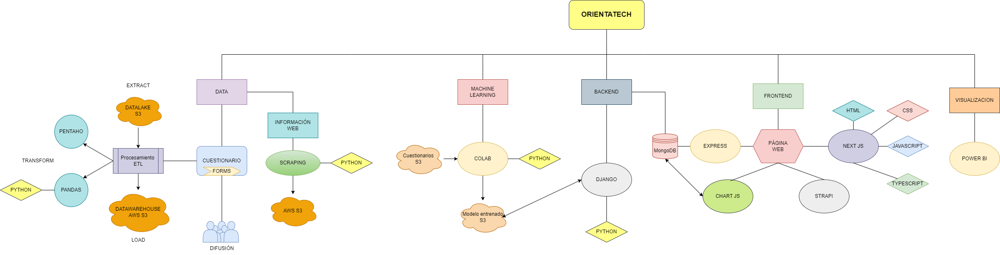

# Proyecto Orientatech

## Autores
* [JADA](https://www.linkedin.com/in/jada1998velez/)
* [Silvia](https://www.linkedin.com/in/silvia-donaire-serrano/)
* [Christian](https://www.linkedin.com/in/itsupportspecialist-sysadmin-christianmd/)
* [Jesús](https://www.linkedin.com/in/jesus-canovas-barqueros-605396294/)
* [Ciro](https://www.linkedin.com/in/ciro-le%C3%B3n-espinosa-avil%C3%A9s-a00646252/)
* [Manuel](https://www.linkedin.com/in/manuel-fajardo-jimenez-ab80b7244/)
* [María](https://www.linkedin.com/in/maria-eugeniasanchez/)
* [Alejandro Castillo]("")
* [Gabriel](https://www.linkedin.com/in/gabriel-postigo-rando-240724191/)
* [Hanane](https://www.linkedin.com/in/hanane-arrazouki/)

## Página Web
https://orientatech-iabd.netlify.app/

## Descripción del proyecto
Este proyecto ha sido elaborado por los estudiantes del Máster de Inteligencia Artificial y Big Data. El trabajo consiste en desarrollar un proyecto por el cual, en base a cuestionarios, ayudaremos a los estudiantes que quieran estudiar un Ciclo Formativo de Grado Superior de informática (ASIR, DAM o DAW) gracias a un algoritmo de inteligencia artificial, el cual es un modelo de Machine Learning.

## Arquitectura

Todos los archivos y tecnologías utilizadas en el proyecto se encuentran en este repositorio, se ha seguido el siguiente modelo de estructura para el proyecto:

*  **Data**: En este directorio encontraremos todos los archivos que han sido utilizados para la parte de *Data* del proyecto, `Scraping web`, `Diagrama de pentaho` y `Cuestionario`.
*  **Macahine Learning**: En este directorio encontramos el `cuaderno jupiter` con el que se ha realizado el entrenamiento del modelo, además del modelo entrenado en cuestión.
*  **Backend**: En este directorio encontraremos el código usado para la implementación de `DJANGO` además de la ruta a nuestra base de datos `MongoDB Compass`
*  **Frontend**: En este directorio encontraremos todos los archivos relacionados con la creación de la página web, `NextJS` y  el servidor `Express`.
*  **Visualización**: En este directorio encontraremos el archivo de `Power BI`, además de un enlace para poder ver la opción *Service* de Power BI

## Documentación del proyecto
La documentación para la realización del proyecto la encontraremos en el archivo [documentación]() que se encuentra en el repositorio

## Presentación
Para poder ver en formato presentación la creación del proyecto podemos descargar el apartado [presentación]() de nuestro repositorio o bien podemos acceder vía web a través de [este]("https://docs.google.com/presentation/d/1dOY5y9bLXMLjUZms1PoDo3-AOWTbgxQ_PcEHacbL1s4/edit?usp=sharing") enlace

## Futuras mejoras

Este proyecto ha recogido aproximadamente 150 ejemplos de datos de estudiantes que han cursado un CFGS, por lo que los datos obtenidos son muy pocos para la gran cantidad de alumnos que cursan esta modalidad. Para crear un modelo más acertado, además de obtener unas gráficas más detalladas en las que poder plasmar la actividad escolar de estos alumnos.

La página web también podría obtener algunas mejoras, como apartados en los que los alumnos puedan indagar más sobre el contenido de las materias a cursar, además de un buscador por cercanía para saber cuál sería el centro más próximo a su predicción dada por el modelo, teniendo en cuenta la nota media de corte que exsite para poder matricularse en ese centro de estudios.

Otra mejora interesante sería poder adaptar los datos para alumnos que quieran estudiar un máster de FP realacionado con estos Ciclos Formativos.

Como último punto a mejorar, con los datos suficientes, se podría implementar un modelo el cual pueda definir ya no solo las FP relacionadas con la informática, sino de cualquier FP de Grado Superior. Para ello sería necesario adecuar unos cuestionarios muy específicos los cuales deberían ser creados por Psicólogos con experiencia en este ámbito.

## Agradecimientos
Se agradece a todo el alumnado y ex-alumnado que se ha prestado voluntario para a la realización de estos cuestionarios, además de a los profesores que han sido de gran ayuda para la difusión de los mismos.
